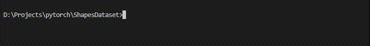
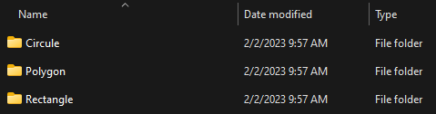
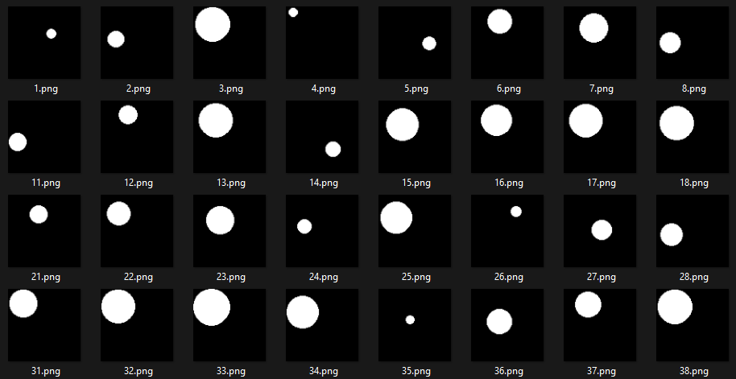
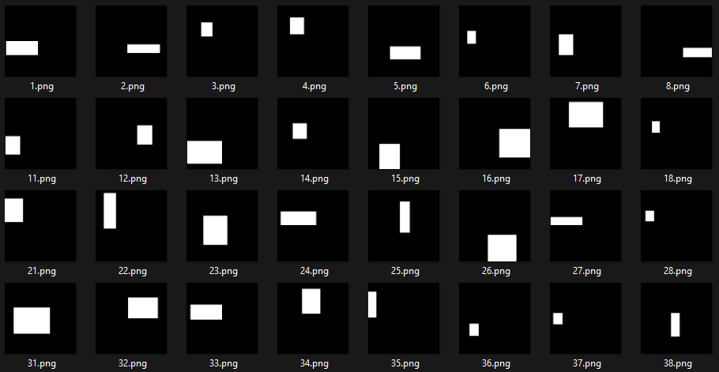
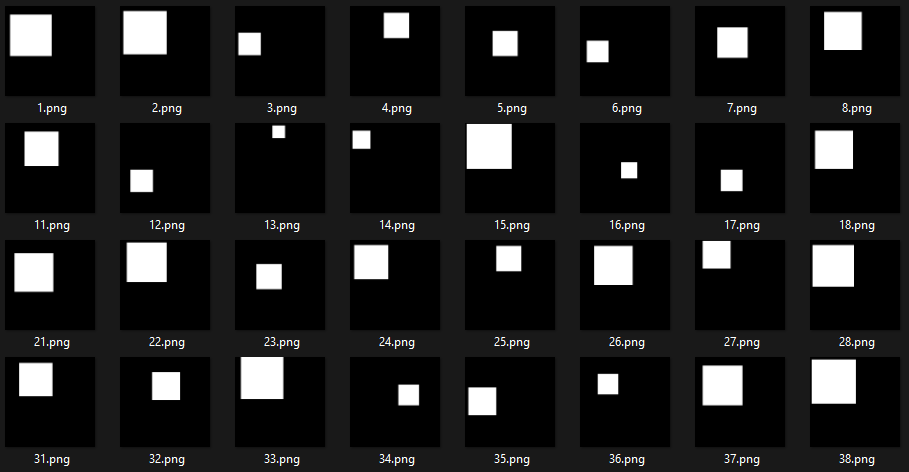

# ShapesDataset

Since newbies in machine learning need simple datasets for starting to train and avoiding complex datasets issus, we're going to write simple madule to generate dataset of shapes by choosing simple choses. like how many class do you need? or Which classes would you like? Choose from Triangle, Squar, Circle, Star and etc.


You can run it simply by just "python app.py {countOfClass} {countOfSamples} {samplesColorType} {samplesWidth* samplesHeight}" where samplesColorType can include binary, etc.
## To run code do like this:
```
python app.py 3 500 binary 100*100 
```

## Result can be like this:


## Generated Shapes
You can see some of generated shapes in bellow:
### Circle

### Rectangular

### Square
